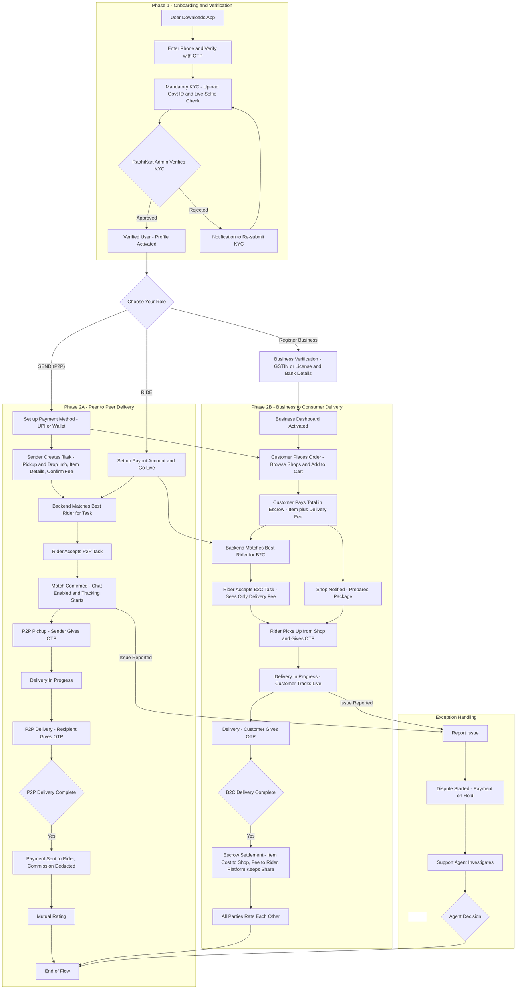

# RaahiKart

# 📅 Project Timeline

This timeline outlines our development plan over three weeks, culminating in a final deployed application and presentation.

---

## 🟩 Week 1 (Goal: Core Functionality & Onboarding)

- 🔧 **Backend**
  - Project Setup
  - Database Schema Design

- 🎨 **Frontend**
  - User Onboarding UI
  - KYC Flow Implementation

- 🔗 **Integration**
  - Connect Onboarding Flow to Backend

- ✏️ **Frontend**
  - Profile Page UI
  - Task Creation UI

---

## 🟨 Week 2 (Goal: 80% Completion – End-to-End Flow)

- 🧠 **Backend**
  - Smart Matching Logic
  - Peer-to-Peer (P2P) Interaction Logic

- 📱 **Frontend**
  - Live P2P Tracking UI
  - OTP Verification UI

- 🔄 **Integration**
  - Full End-to-End P2P Flow Test

- 🧾 **Parallel Task**
  - Business Onboarding Panel/UI

- ✅ **Milestone**
  - 80% Completion Achieved

---

## 🟥 Week 3 (Goal: Finalize, Deploy & Document)

- 👥 **Feature Development**
  - B2C Flow (UI + Backend)

- 🧼 **Quality**
  - UI Polishing
  - Bug Fixing

- 🧪 **Testing**
  - Final End-to-End Test Cycle

- 🚀 **Deployment**
  - Live Server Deployment

- 📝 **Documentation**
  - Final Report Preparation
  - Presentation Slide Deck

- 🎯 **Milestone**
  - Final Project Submission & Demo

---
