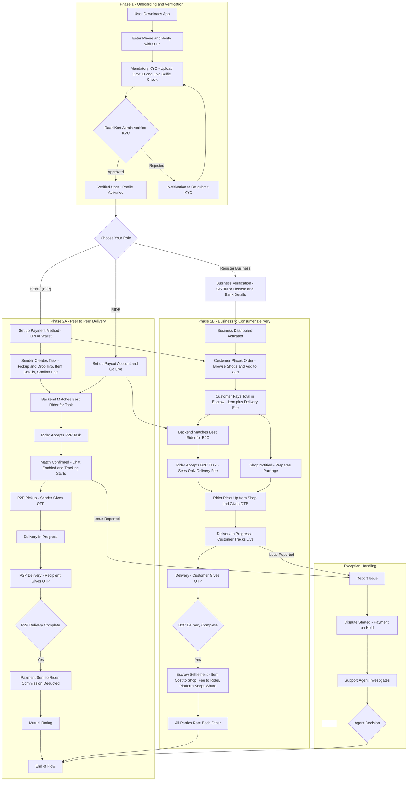
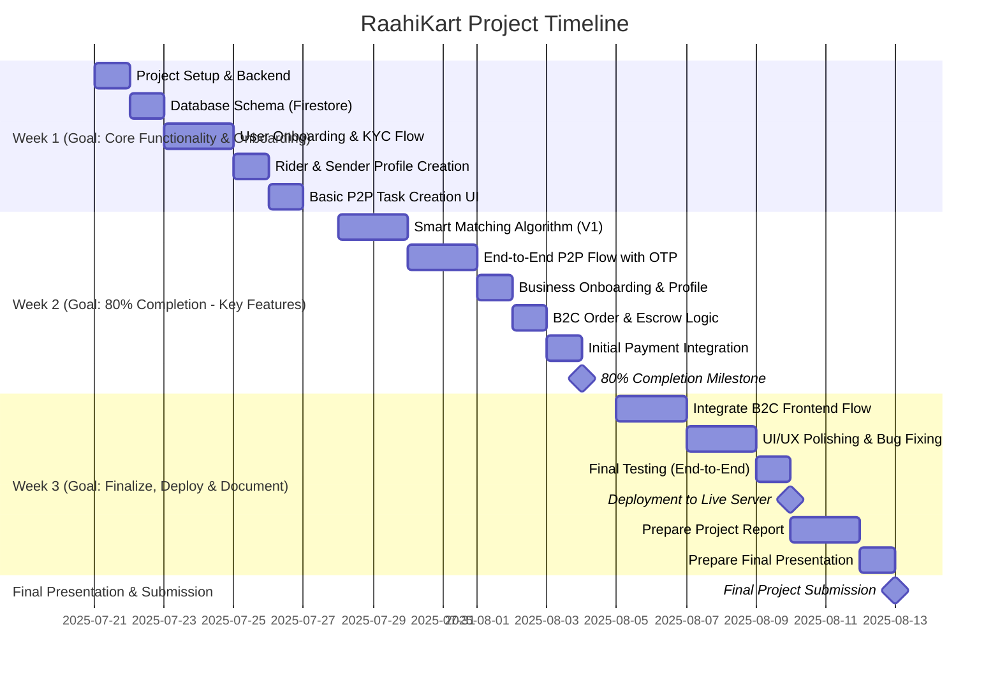

# RaahiKart

```mermaid
graph TD
    subgraph "Phase 1 - Onboarding and Verification"
        A[User Downloads App] --> B[Enter Phone and Verify with OTP]
        B --> C[Mandatory KYC - Upload Govt ID and Live Selfie Check]
        C --> D{RaahiKart Admin Verifies KYC}
        D -- Approved --> E[Verified User - Profile Activated]
        D -- Rejected --> F[Notification to Re-submit KYC]
        F --> C
    end

    E --> G{Choose Your Role}
    G -- SEND (P2P) --> H[Set up Payment Method - UPI or Wallet]
    G -- RIDE --> I[Set up Payout Account and Go Live]
    G -- Register Business --> J_BUS[Business Verification - GSTIN or License and Bank Details]
    J_BUS --> K_BUS[Business Dashboard Activated]

    subgraph "Phase 2A - Peer to Peer Delivery"
        H --> J[Sender Creates Task - Pickup and Drop Info, Item Details, Confirm Fee]
        J --> K[Backend Matches Best Rider for Task]
        I --> K
        K --> L[Rider Accepts P2P Task]
        L --> M[Match Confirmed - Chat Enabled and Tracking Starts]
        M --> N[P2P Pickup - Sender Gives OTP]
        N --> Q[Delivery In Progress]
        Q --> R[P2P Delivery - Recipient Gives OTP]
        R --> T{P2P Delivery Complete}
        T -- Yes --> V[Payment Sent to Rider, Commission Deducted]
        V --> W[Mutual Rating]
        W --> X[End of Flow]
    end

    subgraph "Phase 2B - Business to Consumer Delivery"
        H --> B1[Customer Places Order - Browse Shops and Add to Cart]
        K_BUS --> B1
        B1 --> B2[Customer Pays Total in Escrow - Item plus Delivery Fee]
        B2 --> B3[Shop Notified - Prepares Package]
        B2 --> B4[Backend Matches Best Rider for B2C]
        I --> B4
        B4 --> B5[Rider Accepts B2C Task - Sees Only Delivery Fee]
        B5 --> B6[Rider Picks Up from Shop and Gives OTP]
        B3 --> B6
        B6 --> B7[Delivery In Progress - Customer Tracks Live]
        B7 --> B8[Delivery - Customer Gives OTP]
        B8 --> B9{B2C Delivery Complete}
        B9 -- Yes --> B10[Escrow Settlement - Item Cost to Shop, Fee to Rider, Platform Keeps Share]
        B10 --> B11[All Parties Rate Each Other]
        B11 --> X
    end

    subgraph "Exception Handling"
        Z00[ ]:::invisible
        style Z00 fill:#ffffff,stroke:#ffffff
        M -- Issue Reported --> Z[Report Issue]
        B7 -- Issue Reported --> Z
        Z --> ZA[Dispute Started - Payment on Hold]
        ZA --> ZB[Support Agent Investigates]
        ZB --> ZC{Agent Decision}
        ZC --> X
    end

```

```mermaid
gantt
    title RaahiKart Project Timeline
    dateFormat  YYYY-MM-DD
    axisFormat  %Y-%m-%d

    section Week 1 (Goal: Core Functionality & Onboarding)
    Project Setup & Backend           : 2025-07-21, 1d
    Database Schema (Firestore)      : 2025-07-22, 1d
    User Onboarding & KYC Flow       : 2025-07-23, 2d
    Rider & Sender Profile Creation  : 2025-07-25, 1d
    Basic P2P Task Creation UI       : 2025-07-26, 1d

    section Week 2 (Goal: 80% Completion - Key Features)
    Smart Matching Algorithm (V1)    : 2025-07-28, 2d
    End-to-End P2P Flow with OTP     : 2025-07-30, 2d
    Business Onboarding & Profile    : 2025-08-01, 1d
    B2C Order & Escrow Logic         : 2025-08-02, 1d
    Initial Payment Integration      : 2025-08-03, 1d
    80% Completion Milestone         : milestone, 2025-08-04, 0d

    section Week 3 (Goal: Finalize, Deploy & Document)
    Integrate B2C Frontend Flow      : 2025-08-05, 2d
    UI/UX Polishing & Bug Fixing     : 2025-08-07, 2d
    Final Testing (End-to-End)       : 2025-08-09, 1d
    Deployment to Live Server        : milestone, 2025-08-10, 0d
    Prepare Project Report           : 2025-08-10, 2d
    Prepare Final Presentation       : 2025-08-12, 1d

    section Final Presentation & Submission
    Final Project Submission         : milestone, 2025-08-13, 0d


```

